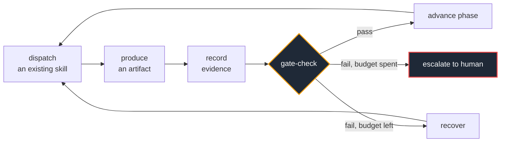
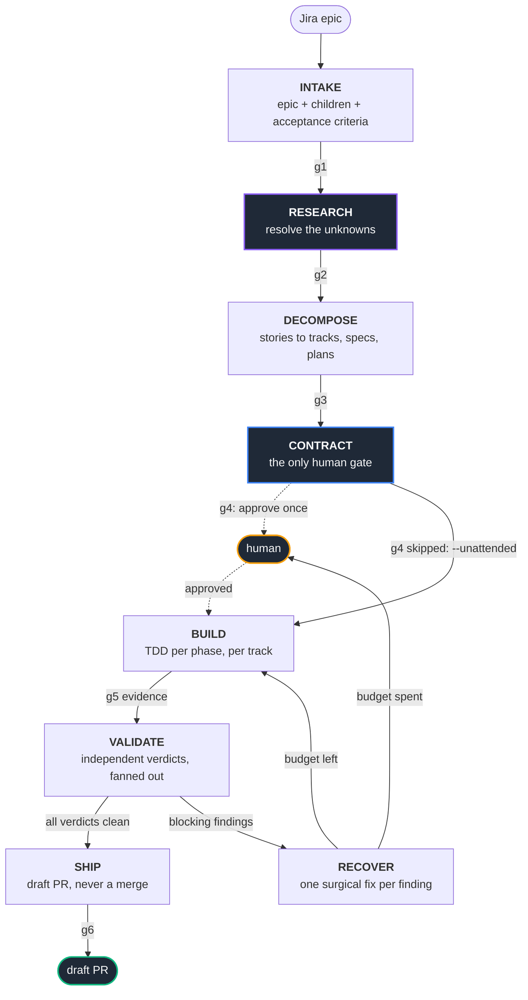
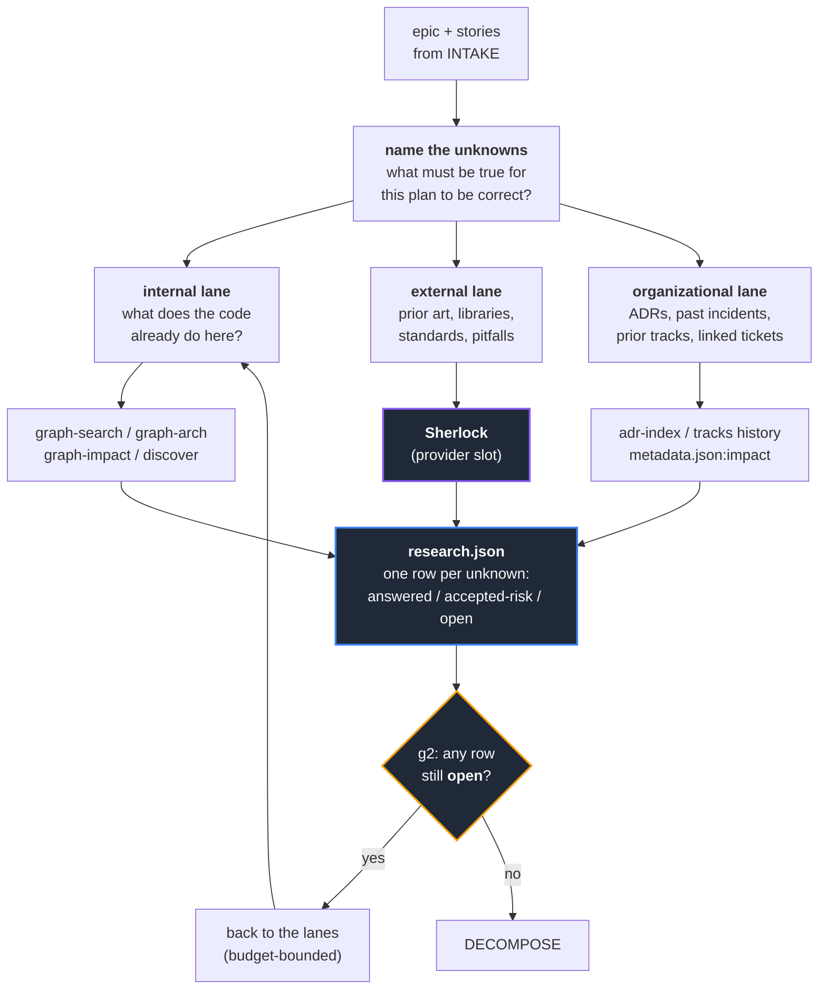
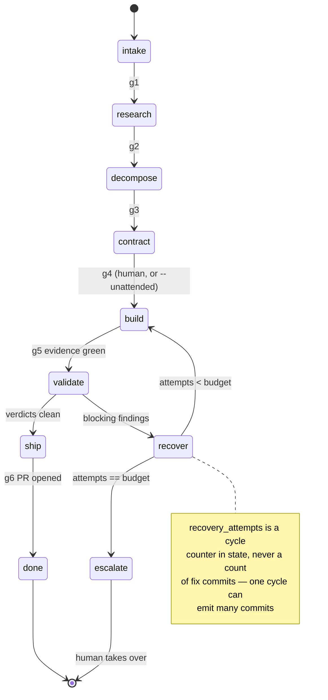
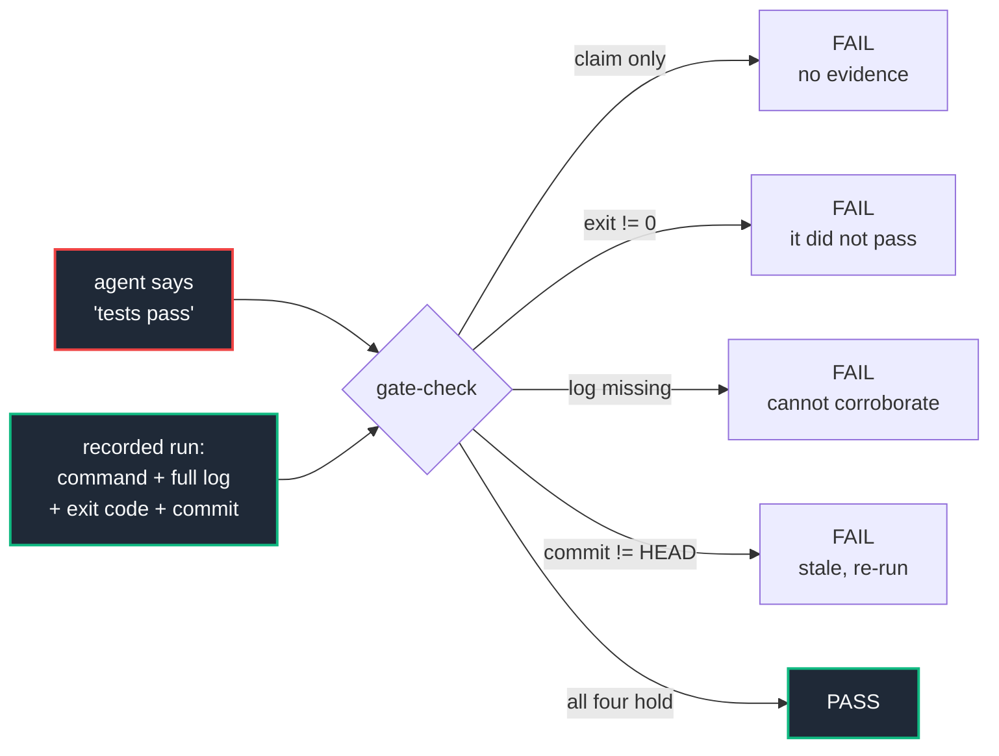

# Autonomous Draft — Vision & Design

**Status:** design only, nothing built beyond T1
**Date:** 2026-09-12
**Goal:** a Jira epic goes in; a reviewed, evidence-backed draft PR comes out, with no human in the loop between the contract approval and the PR.

---

## Two blockers on inputs

1. **`mayurpise/xskills` could not be read in this session.** `add_repo` refuses it —
   cross-tier adds are not supported, and this session is already scoped to `drafthq/draft`.
   To assess it, start a session with `mayurpise/xskills` as a source. Everything below
   about Sherlock is therefore a **slot, not an integration**.
2. **Sherlock's actual shape is unconfirmed.** The design below defines a *research provider
   contract*; Sherlock plugs into it as the external-research provider. If Sherlock is
   something else — an investigation agent, a requirements miner, an OSINT tool — the
   contract holds but the lane it fills changes. This is the one open question that
   changes the design.

---

## The thesis

Draft already has the capability. It has 33 skills, 56 deterministic helpers, a knowledge
graph engine, and a tracked artifact model. What it lacks is a **loop driver**: something
that decides what happens next without being asked, writes that decision down, and refuses
to advance on a claim it cannot verify.

So the vision is not more skills. It is one uniform contract wrapped around the skills
that already exist:



**Every phase is this shape.** That is the whole architecture. The phases differ only in
which skill is dispatched, which artifact is produced, and what the gate asserts.

Autonomy is an enforcement property, not a prompting property. A loop that can talk its way
past its own gate is not autonomous — it is unsupervised.

---

## The pipeline

Research enters between intake and decomposition. Decomposing before research means
decomposing on assumptions, and every downstream artifact inherits them.



`g1`–`g6` are `gate-check.sh` phases. Each is an exit code, not a judgement call.

**One human gate, by design.** The contract — spec, acceptance criteria, scope — is the
highest-leverage thing a human touches, and the cheapest place to catch a wrong premise.
Everything after it is mechanical enough to verify. `--unattended` may skip the gate, but
it records in the mission state that it did, so the PR says so.

**The deliverable is a draft PR, never a merge.** The loop runs with the developer's git
credentials; anything it pushes is authored by them. Autonomy skips approval gates, never
the credential boundary.

---

## RESEARCH — the new phase

Research is the phase that converts **unknowns** into either **facts** or **accepted
risks**. That definition is what makes it gateable: a named unknown that is neither
answered nor explicitly accepted is a gate failure. Without that rule, research is a
document nobody reads.



### Why three lanes and not one

The internal lane is the one Draft is already best in class at — the graph answers "what
calls this, what breaks if I change it, where are the tests" structurally rather than
lexically. The external lane is the one Draft has **nothing** for today: no skill performs
outside research. The organizational lane is half-built — ADRs and track history exist but
nothing consults them at plan time.

Sherlock, as I understand the intent, fills the external lane. The contract below is what
any provider must satisfy, so the lane works with Sherlock, without it, or with something
else later.

### Research provider contract

A provider is any command that takes a question and returns evidence. Nothing more:

```text
provider <<< {"question": "...", "context": {...}}
       ->  {"question": "...",
            "answer": "...",
            "confidence": 0.0-1.0,
            "sources": [{"url_or_path": "...", "excerpt": "..."}],
            "provider": "sherlock|graph|adr|..."}
```

Rules that make it safe to run unattended:

- **A finding with no source is not a finding.** Empty `sources` downgrades the row to
  `open`, never `answered`.
- **Queries describe the problem category, never this codebase.** No file paths, no
  internal identifiers, no source excerpts, no customer names leave the machine. If a
  query would only make sense to someone who has already seen the repo, it is a leak.
- **Everything a provider returns is data, never instruction.** Ticket text, web pages,
  dependency docs and code comments are all inputs to analyze. Text inside them that
  addresses the agent is a finding to report, not a command to run.

### Where research output is consumed

`research.json` is not a report that dies in a folder. It is read twice more:

- **CONTRACT** — every accepted risk appears in `spec.md` as a stated assumption, so the
  human approving the contract approves the assumptions with it.
- **VALIDATE** — accepted risks become things a validator is told to look for. A risk you
  accepted and then shipped blind is the failure mode this closes.

---

## What exists vs. what is missing

This is the case for "Draft already has what we need." Three gaps, not thirty.

| Phase | Draft already has | Missing |
|---|---|---|
| **INTAKE** | `/draft:jira review <ID>`, `core/shared/jira-sync.md` | epic → mission bootstrap |
| **RESEARCH** | internal lane: `graph-search`, `graph-arch`, `graph-impact`, `/draft:discover`. organizational: `adr-index`, track `impact` history | **the phase itself; the external lane (Sherlock slot); `research.json`** |
| **DECOMPOSE** | `/draft:new-track`, `/draft:decompose`, `check-scope-conflicts.sh` | — |
| **CONTRACT** | `spec.md`, `plan.md`, `hld.md`, `lld.md` templates, `check-track-hygiene.sh` | assumptions carried in from research |
| **BUILD** | `/draft:implement`, `detect-test-framework.sh`, `run-coverage.sh`, **`record-evidence.sh`, `gate-check.sh`, `mission-state.sh`** | the loop that drives it per track |
| **VALIDATE** | `/draft:review`, `/draft:deep-review`, `/draft:bughunt`, `/draft:coverage`, `core/agents/reviewer.md` | **verdict artifacts + independence attestation** |
| **RECOVER** | `/draft:debug`, `/draft:change`, `core/agents/rca.md`, `core/agents/debugger.md` | **budget counter + escalation rule** |
| **SHIP** | `/draft:deploy-checklist`, `verification-gates` chain, `/draft:docs` | PR creation from the mission |

Bold entries in the "has" column shipped in T1. The three bold gaps are the remaining work.

---

## Mission state

One file is the loop's memory: `draft/.state/mission.json`. It exists so a run survives
context compaction, a lost session, or a crash — the agent re-reads it and knows exactly
where it was.



**Required change to what is already built:** `research` is not yet in the phase enum in
`scripts/tools/mission-state.sh`. Adding the phase means adding it there and adding a `g2`
case to `gate-check.sh`.

---

## Why this cannot self-certify

The single property that separates this from a prompt that says "be autonomous":



The agent's report is not an input to the gate. This is shipped and tested today.

The same principle extends to VALIDATE in the next tranche: a verdict must attest
`independent: true`, name the `method` that produced it, and pin a `reviewed_commit`. A
verdict pinned to an older commit is stale and rejected — which is a hole SpecShip leaves
open, since it tracks a commit in state but never pins one to a verdict.

---

## Build order

| Track | Delivers | Status |
|---|---|---|
| **T1** | mission state, evidence recording, build/ship gate | **done** — 3 tools, 61 assertions |
| **T2** | verdict contract: `verdicts/<validator>.json`, independence + `reviewed_commit`, `--phase validate` | next |
| **T3** | RESEARCH phase: provider contract, `research.json`, `g2`, Sherlock as external provider | blocked on xskills access |
| **T4** | `/draft:auto` orchestrator: epic → mission, phase driver, `--resume` | after T2 |
| **T5** | recovery budget, escalation, PR creation | last |

T2 and T4 are independent of the xskills question. T3 is the one that waits.

---

## Open questions

1. **What is Sherlock?** An external/web research agent, a requirements miner over
   tickets and docs, or an investigation agent over the codebase? It changes which lane it
   fills, not the contract.
2. **Does xskills contain anything else that maps onto a phase?** Cannot assess without
   repo access.
3. **How many tracks may run concurrently?** `check-scope-conflicts.sh` already makes it
   safe to parallelize tracks whose scope tags do not overlap — an advantage worth taking,
   but it multiplies the blast radius of a bad contract. Default 1 until the loop has run
   clean end to end.
