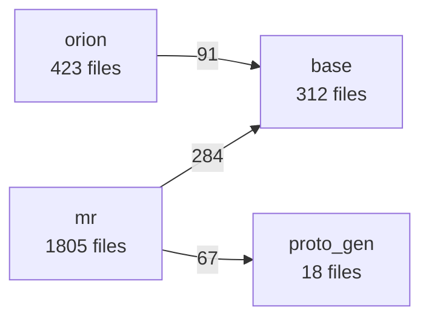

# Draft Knowledge Graph

The graph subsystem builds a **deterministic, language-aware knowledge graph** of a codebase and stores it as compact JSONL files under `draft/graph/`. Every draft skill that needs structural information about the repository — module boundaries, dependency edges, call graphs, hotspots, proto RPC surfaces — reads from this graph instead of re-scanning source files. This document explains what the graph is, how it is built, what algorithms it uses, and how it improves the accuracy of AI coding decisions.

---

## Table of Contents

1. [Why a Graph?](#why-a-graph)
2. [Build Pipeline](#build-pipeline)
3. [Module Detection](#module-detection)
4. [Extractors](#extractors)
   - [C/C++ Include Graph](#cc-include-graph)
   - [Go Extractor](#go-extractor)
   - [Python Extractor](#python-extractor)
   - [TypeScript / JavaScript Extractor](#typescript--javascript-extractor)
   - [C/C++ Symbol Extractor](#cc-symbol-extractor)
   - [Proto Extractor](#proto-extractor)
   - [ctags Fallback](#ctags-fallback)
5. [Cross-File Symbol Resolution](#cross-file-symbol-resolution)
6. [Output Schema](#output-schema)
7. [Query Modes](#query-modes)
8. [Hotspot Scoring](#hotspot-scoring)
9. [Determinism and Incremental Builds](#determinism-and-incremental-builds)
10. [How the Graph Improves AI Decisions](#how-the-graph-improves-ai-decisions)
11. [Running the Graph Builder](#running-the-graph-builder)

---

## Why a Graph?

AI coding assistants operating on large codebases face a hard signal-to-noise problem: they must reason about which files matter, which modules they belong to, what depends on what, and which functions are risk hotspots — before writing a single line of code. Without structural grounding, an assistant guesses. With it, decisions become auditable.

The graph solves four concrete problems:

| Problem | Without graph | With graph |
|---------|---------------|------------|
| **Module scope** | AI scans filenames heuristically | Exact top-level module boundaries, sorted deterministically |
| **Dependency direction** | AI reads import statements in sampled files | Weighted inter-module edge matrix merged across all languages |
| **Change impact** | AI reasons narratively about "what might break" | BFS over include/import graph gives exact blast radius with depth labels |
| **Complexity hotspots** | AI relies on subjective signal | Reproducible score: `lines + fan_in × 50` per file |

Because the output is JSONL on disk, the graph is read by the same process as any other file — no database, no network call, no latency.

---

## Build Pipeline

The builder runs in five sequential phases inside `src/index.js`. All writes go to a temporary directory first; the final output is committed atomically via `rename(2)` so that concurrent readers always see a complete graph.

```
Phase 1 Detect modules
         └─ Walk repo root; emit one module per top-level directory
            that contains at least one source file (recursive).

Phase 2 Build C++ include graph
         └─ Textual #include parsing; produces file nodes + include
            edges + aggregated module-level edges with weights.

Phase 3 Parse proto definitions
         └─ Line-by-line proto parser; produces services, RPCs,
            messages, enums.

Phase 4 Index Go / Python / TypeScript / C++ in parallel
         └─ tree-sitter WASM (primary) or regex (fallback) for each
            language; extracts functions, types, imports, call edges.

Phase 5 ctags fallback for remaining languages
         └─ Shells out to universal-ctags for Java, Rust, Ruby,
            Swift, and any other language not handled above.

Write Merge all indexes → JSONL files → atomic rename to output dir
```

A single directory walk (`collectAllFiles`) is shared across all phases. Files are bucketed by extension once; each extractor receives its bucket without additional I/O.

---

## Module Detection

`src/modules.js` defines a **module** as any top-level directory containing at least one source file (recursively). Source extensions recognised: `.cc .cpp .cxx .c .h .hpp .go .py .java .rs .ts .tsx .js .jsx .mjs .cjs .proto`.

**Algorithm:**
1. Read the repo root directory entries.
2. For each subdirectory, recursively count files by extension. Directories with zero source files (pure docs, configs, data) are excluded.
3. A special `__root__` module is synthesised for source files at the repo root that are not inside any directory.
4. Results are sorted by name to guarantee **deterministic output** regardless of filesystem ordering.

Each module record carries:

```json
{
  "name": "apollo",
  "path": "/workspace/main/apollo",
  "sizeKB": 84320,
  "files": { "cc": 812, "h": 934, "go": 0, "proto": 47, "py": 12,
             "java": 0, "rs": 0, "ts": 0, "total": 1805 }
}
```

---

## Extractors

### C/C++ Include Graph

**File:** `src/extractor-includes.js`
**Method:** Purely textual — no compiler, no tree-sitter.

Every `.cc`, `.cpp`, `.cxx`, `.h`, `.hpp` file is read line-by-line. Lines that begin with `#include "..."` (quoted form only — angle-bracket system headers are irrelevant to module structure) are parsed. The include path is resolved to a repo-relative path via a pre-built file index (filename → list of candidate paths), applying same-directory and parent-directory heuristics.

**Why quoted only:** The graph models intra-repo structural dependency. System headers (`<vector>`, `<memory>`) add noise without adding signal about how the repo's own modules relate.

**Output per file:**
- File node: `id`, `module`, `path`, `lines`, `kind` (header vs source), `ext`
- Include edge: `source → target` (repo-relative paths)
- Module edge: aggregated by `source_module → target_module` with `weight` = count of include relationships crossing that boundary

Module edges are sorted by weight descending. A high-weight edge (e.g., `mr→base` weight 284) indicates tight coupling and is the primary signal used by `draft:decompose` to draw the architecture diagram.

**Accuracy:** 100% for quoted includes within a single-root repo. Excludes generated files (`*.pb.cc`, `*.pb.h`, `*_generated*`) and vendor/third-party paths by default.

---

### Go Extractor

**File:** `src/extractor-go.js`
**Primary method:** tree-sitter WASM (`tree-sitter-go` grammar, loaded from either the SEA binary asset or the `tree-sitter-wasms` npm package).
**Fallback:** Regex-based extraction (~95% accurate for Go, which has highly regular syntax).

**What it extracts:**

| Record | Fields |
|--------|--------|
| `go-func` | name, receiver (for methods), qualified name, file, module, package, line, total lines |
| `go-type` | name, kind (`struct`/`interface`/`alias`/`type`), file, module, package, line |
| `go-import` | import path, local alias, file, module |
| `go-call` | caller function, callee name, file, module, line number |

**Import resolution:** Import paths are matched against the known module names in the repo. For example, an import `"example.com/myrepo/storage/blob"` is resolved to module `storage` if `storage` appears in the module list. This produces the Go contribution to the inter-module dependency edge matrix.

**Call edge confidence:**
- `direct` — callee is a bare identifier (`foo()`)
- `inferred` — callee is the trailing name of a selector expression (`store.Get()`, `r.Flush()`)

Inferred edges are useful as investigation leads but should not be treated as confirmed call paths because multiple types can have methods of the same name.

---

### Python Extractor

**File:** `src/extractor-python.js`
**Primary method:** tree-sitter WASM (`tree-sitter-python` grammar).
**Fallback:** Regex-based extraction (~90% accurate).

**What it extracts:**

| Record | Fields |
|--------|--------|
| `py-func` | name, receiver (for methods), file, module, line, total lines |
| `py-class` | name, base classes, file, module, line |
| `py-import` | import path, alias, file, module |
| `py-call` | caller, callee, file, module, line |

Tree-sitter is preferred because Python's significant-whitespace indentation rules and nested function definitions are difficult to parse correctly with regex. The tree-sitter AST eliminates ambiguity in class/method nesting depth.

---

### TypeScript / JavaScript Extractor

**File:** `src/extractor-ts.js`
**Primary method:** tree-sitter WASM — two separate grammars: `tree-sitter-typescript` (for `.ts`, `.js`, `.mjs`, `.cjs`) and `tree-sitter-tsx` (for `.tsx`, `.jsx`).
**Fallback:** Regex (~90% accurate for common patterns).

**What it extracts:**

| Record | Fields |
|--------|--------|
| `ts-func` | name, file, module, line, total lines, exported, enclosing class, async flag |
| `ts-class` | name, kind (`class`/`interface`/`type`), file, module, line, exported |
| `ts-import` | `from` path, imported names, file, module |
| `ts-call` | caller, callee, file, module, line |

Import `from` paths are resolved to module names using prefix matching: `../storage/blob` → module `storage`. This contributes to the TS column of the inter-module edge matrix.

---

### C/C++ Symbol Extractor

**File:** `src/extractor-c.js`
**Primary method:** tree-sitter WASM — `tree-sitter-c` for `.c`/`.h` files and `tree-sitter-cpp` for `.cc`/`.cpp`/`.cxx`/`.hpp` files. The extractor detects C++ headers by the presence of `class ` in content when the extension is ambiguous.
**Fallback:** universal-ctags shell-out (if available).
**Final fallback:** Silent skip — the include graph already provides the structural signal.

**What it extracts:**

| Record | Fields |
|--------|--------|
| `c-func` | name, file, module, line, total lines, language (`c`/`cpp`), namespace |
| `c-type` | name, kind (`struct`/`class`/`enum`), file, module, line, language |
| `c-call` | caller, callee, file, module, line |

**Important:** The C/C++ symbol extractor **supplements** the include graph; it does not replace it. For C++ codebases, include-graph edges are the dominant structural signal. Symbol extraction enables function-level `callers` queries and hotspot scoring by line count.

Function **declarations** in headers are intentionally skipped — only definitions are indexed, because declarations produce too much noise in large codebases where every consumer re-declares the same signatures.

---

### Proto Extractor

**File:** `src/extractor-proto.js`
**Method:** Pure line-by-line parsing — no proto compiler needed.

**What it extracts:**

| Record | Fields |
|--------|--------|
| `service` | name, file, module |
| `rpc` | name, service, request type, response type, file, module, line |
| `message` | name, file, module, line |
| `enum` | name, file, module, line |

Multi-line RPC definitions (where `rpc Foo(` and `)` span multiple lines) are handled by buffering partial lines until the closing `)` is found. Brace depth is tracked by stripping option blocks (`[...]`) and string literals before counting `{`/`}` characters.

The proto index is consumed by:
- `draft:decompose` — renders the `GRAPH:PROTO-MAP` section of `.ai-context.md`
- `mermaid.js` — generates the proto-map Mermaid diagram
- `draft:init` — surfaces RPC surface in architecture documentation

---

### ctags Fallback

**File:** `src/extractor-ctags.js`
**Trigger:** Languages not covered by any native extractor.

Covered extensions: `.java .rs .rb .swift .kt .cs .scala .php .lua .r .m` (the last is treated as Objective-C). The extractor invokes `universal-ctags` (detected via `which ctags` with version validation) on files matching these extensions and parses the JSON output to emit `ctags-sym` records carrying the symbol name, file, module, line, ctags kind, and language.

**Scope caveat (often misunderstood):** ctags records are written **only into per-module JSONL files** (`draft/graph/modules/<name>.jsonl`). They are deliberately **not** merged into the global `hotspots.jsonl`, `call-index.jsonl`, or any `<language>-index.jsonl`. Coverage is treated as opportunistic — useful when working within a module that contains those languages, but not relied upon for cross-module analysis. If ctags is not installed, the extractor silently skips with no impact on the rest of the pipeline.

---

## Cross-File Symbol Resolution

**File:** `src/resolver.js`

After all language extractors run, a resolution pass walks every call edge (`go-call`, `py-call`, `ts-call`, `c-call`) and attempts to resolve the syntactic callee name to a concrete file/line/symbol using a global symbol table built from all indexes.

**Resolution policy (deliberately conservative):**

| Language | Strategy |
|----------|----------|
| Go | Import alias lookup → package name lookup → same-package lookup → receiver method deduction |
| C/C++ | Fully qualified name (`Foo::Bar::baz`) → namespace chain lookup; else same-namespace lookup |
| Python / TS | Same-file → same-module → global by name |

Each resolved edge receives:
- `resolved: true` + `toFile` + `toLine` + `toId` when exactly one match is found (`confidence: exact`)
- `resolved: true` + `candidates: [{file, line, id}]` (capped to 5) when multiple matches exist (`confidence: ambiguous`)
- `resolved: false` for no match (`confidence: unresolved`)

**Why conservative?** False matches are worse than missed matches for downstream AI consumers. An AI that follows a wrong call path and confidently draws an incorrect conclusion causes more damage than one that says "I couldn't resolve this call." All unresolved call edges are flagged so skills can treat them appropriately.

---

## Output Schema

All output lives under `draft/graph/`. Files are compact JSONL (one JSON object per line) — no database, no binary format. Any tool can read them with `cat` or `jq`.

```
draft/graph/
├── schema.yaml — metadata: generated_at, module count, language stats
├── module-graph.jsonl — inter-module dependency graph (always load)
├── proto-index.jsonl — gRPC service/RPC/message/enum catalog (always load)
├── hotspots.jsonl — top 50 files by complexity (always load)
├── go-index.jsonl — Go symbols + call edges
├── python-index.jsonl — Python symbols + call edges
├── ts-index.jsonl — TypeScript/JS symbols + call edges
├── c-index.jsonl — C/C++ symbols + call edges
├── call-index.jsonl — all intra-file call edges across all languages
├── module-deps.mermaid — pre-rendered module dependency diagram
├── proto-map.mermaid — pre-rendered proto service topology
├── hashes.json — per-module SHA-256 hashes (incremental build artifact)
└── modules/
    ├── <module>.jsonl — per-module file graph + all language symbols
    └── ...
```

The two `.mermaid` files are static artifacts regenerated on every build. `/draft:init` reads them directly into `draft/architecture.md` so the architecture document carries a current, machine-rendered dependency picture without re-running the builder.

### module-graph.jsonl

Two record kinds: `node` (one per module) and `edge` (one per inter-module dependency).

```jsonc
// node
{ "kind": "node", "id": "mr", "type": "module",
  "sizeKB": 84320, "files": { "cc": 812, "h": 934, "go": 0, "proto": 47,
                               "py": 12, "total": 1805 } }

// edge
{ "kind": "edge", "source": "mr", "target": "base", "weight": 284 }
```

The `weight` on an edge is the total number of include/import relationships crossing that module boundary, aggregated across **C++ `#include`s, Go imports, and TypeScript imports**. Python imports and ctags-discovered languages do **not** currently contribute to module edges — they are extracted but only feed the symbol indexes. Higher weight = tighter coupling.

The merged edge list is not strictly sorted by weight in the final JSONL. C++ edges arrive pre-sorted by weight desc from `extractor-includes`; Go and TS edges are merged in via map insertion order. Consumers that need a strictly ranked view should sort client-side or read the pre-sorted `module-deps.mermaid` (which shows the top edges by weight).

### hotspots.jsonl

```jsonc
{ "kind": "hotspot", "id": "mr/infra/tenant_manager.cc", "module": "mr",
  "lines": 4821, "fanIn": 7 }
```

Score formula: `lines + fanIn * 50`. The score is used internally to rank and select the top 50, then **stripped from the written record** — the file's position in `hotspots.jsonl` (line order) is the score signal consumers should rely on. If you need the numeric score, recompute it from `lines` and `fanIn` after reading.

Field names: `id` is the repo-relative path (not `file`). This ranks files that are both large and heavily depended upon above files that are merely large.

### modules/<name>.jsonl

The per-module file is the richest artifact. It contains every record type for that module: file nodes, include edges, cross-module include edges, all language symbols and call edges. Skills load it only when working within a specific module to avoid reading the full global index.

---

## Query Modes

The `graph --query` flag enables read-only queries against an existing graph. No rebuild occurs.

| Mode | Input | Output |
|------|-------|--------|
| `callers` | `--symbol <name>` or `--file <path>` | All files/functions that include or call the target |
| `impact` | `--file <path>` | Transitive blast radius (BFS over include graph), with depth labels and category breakdown (code / test / doc / config) |
| `hotspots` | optional `--symbol <module>` filter | Top complexity files, optionally scoped to a module |
| `modules` | — | Inter-module dependency summary |
| `cycles` | — | Circular dependency paths (DFS-based cycle detection) |
| `mermaid` | optional `--symbol module-deps\|proto-map` | Mermaid diagram text for the module dependency graph or proto topology |

### Impact Query — BFS Implementation

The impact query answers: *"If I change this file, what else could break?"*

```
1. Build reverse include index: target_file → [{source_file, module}]
   (computed once in O(modules × records))
2. BFS starting from the changed file.
   - Each visited file is added to the impact list with its depth.
   - Depth 1 = direct includers; depth 2 = includers of includers; etc.
3. Summarize: total files, affected modules, breakdown by category.
4. Warn when blast radius > 50 files.
```

Output example:

```json
{
  "target": "base/component_context.h",
  "impact": {
    "files": 247,
    "modules": 8,
    "affected_modules": ["mr", "orion", "apollo", "zeus", "iris", "healer", "magneto", "scribe"],
    "by_category": { "code": 218, "test": 29, "doc": 0, "config": 0 },
    "files_by_depth": { "1": 31, "2": 89, "3": 127 }
  },
  "warning": "High blast radius: 247 files affected. Consider breaking this dependency."
}
```

This output is consumed by `draft:bughunt` (to scope investigation), `draft:review` (to flag high-risk changes), and `draft:decompose` (to populate the `§Dependencies` table in HLD).

### Mermaid Diagram Generation

`src/mermaid.js` generates readable Mermaid `flowchart LR` diagrams from `module-graph.jsonl`. For large graphs (> 30 nodes or > 80 edges), it automatically filters to the top-weighted edges, computing a minimum weight threshold as `max_weight / 10`. Node labels include file counts to give size context.



---

## Hotspot Scoring

Hotspots identify files that are both complex and heavily referenced — the riskiest files to modify.

**Score formula:**

$$\text{score} = \text{lines} + \text{fanIn} \times 50$$

where `fanIn` is the number of distinct source files that include or import this file.

**Why 50?** The multiplier was calibrated so that a moderately-referenced header (fanIn = 10) with average line count (500 lines) scores comparably to a very large implementation file (1000 lines) with low fan-in (fanIn = 0). This avoids the common failure mode of ranking tiny but central utility headers below thousand-line files nobody imports.

The top 50 hotspots by score are written to `hotspots.jsonl`. The `draft:init` condensation subroutine always includes the top 10 in `.ai-context.md` regardless of tier budget — hotspot awareness is treated as a non-negotiable signal.

---

## Determinism and Incremental Builds

### Determinism

Every sorting operation in the graph builder uses lexicographic or numeric comparators, never insertion order. Specifically:
- Module list: sorted by name (`a.name.localeCompare(b.name)`)
- File lists: sorted by path before hashing (incremental) and before indexing
- Module edges: sorted by weight descending
- Hotspots: sorted by score descending, ties broken by filename

The same repo at the same commit always produces byte-identical output. This is a hard requirement: draft skills compare `synced_to_commit` fields between the graph and the current HEAD to detect stale data.

### Incremental Builds (`--incremental`)

On large monorepos, a full build can take 30–90 seconds. The `--incremental` flag enables module-level caching:

1. Before processing, compute a SHA-256 content hash for every module directory (all source files sorted by path, concatenated).
2. Compare against `hashes.json` from the previous build.
3. Modules whose hash is unchanged are skipped — their per-module JSONL file is copied from the existing output directory.
4. Only changed modules are re-indexed. Global files (`module-graph.jsonl`, `hotspots.jsonl`, etc.) are always recomputed from the merged data.

The hash covers file *contents*, not mtime, so build-system touches (mtime bumps without content change) do not invalidate the cache.

**Atomic write guarantee:** Even in incremental mode, all output goes to a temp directory first. The rename into the final output path is atomic (`rename(2)` on the same filesystem), so graph readers never see a partial build.

---

## How the Graph Improves AI Decisions

The graph feeds into AI context at three points in the draft workflow:

### 1. `.ai-context.md` (via `draft:init`)

The condensation subroutine reads graph artifacts and generates structured sections in `.ai-context.md`:

| `.ai-context.md` section | Source graph artifact | What it tells the AI |
|--------------------------|----------------------|----------------------|
| `GRAPH:COMPONENTS` | `module-graph.jsonl` nodes | Module list with file counts per language — the vocabulary for "where things live" |
| `GRAPH:MODULES` | `module-graph.jsonl` edges | Inter-module dependency matrix (source → target, weight) — directs the AI toward the right dependency direction |
| `GRAPH:HOTSPOTS` | `hotspots.jsonl` top 10 | Which files are both large and central — pre-warns the AI not to casually modify them |
| `GRAPH:CYCLES` | `module-graph.jsonl` DFS | Circular dependency paths, or "None ✓" — tells the AI whether the architecture is acyclic |
| `GRAPH:FAN-IN` | `module-graph.jsonl` edges (tier ≥ 3) | Modules with the most incoming edges — identifies the "dependency hubs" where changes have high blast radius |
| `GRAPH:PROTO-MAP` | `proto-index.jsonl` | RPC service catalog — tells the AI what APIs exist without reading proto files |
| `GRAPH:MODULE-HOTSPOTS` | `hotspots.jsonl` grouped by module (tier ≥ 3) | Per-module top files — enables module-scoped risk assessment |

Without the graph, `.ai-context.md` is narrative prose. With it, every section is precise and machine-readable. The AI stops guessing about which module owns a feature and reads the edge weight instead.

### 2. `hld.md` (via `draft:decompose`)

The decompose skill uses live graph queries to populate pre-computed slots in the HLD template:

| HLD slot | Graph query | What it provides |
|----------|-------------|------------------|
| `GRAPH:track-component-diagram` | Module subgraph for track modules + integration edges | Accurate Mermaid architecture diagram — not hand-drawn |
| `GRAPH:track-component-table` | Module nodes with file counts, fan-in, fan-out, complexity | Per-component data table with citations to source lines |
| `GRAPH:track-dependencies` | Cross-module integration edges touching track modules | Dependency impact table with edge kinds and impact assessment |

**Without the graph:** the AI generates plausible-looking HLD content based on file names and README text. With the graph, every component table row has a citation (`path:line`) and every dependency is a real edge with a measured weight.

### 3. Runtime skill queries (`draft:implement`, `draft:bughunt`, `draft:review`)

During implementation and review, skills query the graph on demand:

- **`draft:implement`** — calls `hotspot-rank.sh` before editing to identify which files in the task scope carry high blast radius, then adjusts the implementation plan.
- **`draft:bughunt`** — calls `graph --query --mode impact` to compute the blast radius of the suspected bug location, surfacing all files that transitively depend on it.
- **`draft:review`** — checks whether changed files appear in `hotspots.jsonl`; if so, escalates the review scrutiny level.
- **`draft:decompose`** — calls `cycle-detect.sh` to detect cycles introduced by the proposed module decomposition.

### Why JSONL on disk rather than an API

Sending the graph to the AI as raw JSONL would consume the entire context window. Instead:

1. The **condensation subroutine** extracts the signal-dense subset (top edges, top hotspots, cycle status) and compresses it into the structured plain-text format of `.ai-context.md`.
2. Skills query specific files **on demand** (e.g., load `modules/mr.jsonl` only when working on an `mr/` task), rather than loading the full index every time.
3. The full graph is always available for precise queries — the AI can ask "what calls `tenant_manager::Apply`?" and get an exact answer from `call-index.jsonl` without re-scanning source.

This architecture keeps the AI's active context small and precise while ensuring every structural claim it makes is grounded in deterministic data.

---

## Skill Contract: Graph-First Lookup

The technical pipeline above only delivers value if every skill actually consults the graph **before** falling back to filesystem scans. As of the May 2026 refactor (see [`docs/audit/graph-first-token-light-plan.md`](../docs/audit/graph-first-token-light-plan.md)), this is a binding contract — not a soft recommendation. The contract is single-sourced in [`core/shared/graph-query.md`](../core/shared/graph-query.md) and [`core/shared/red-flags.md`](../core/shared/red-flags.md) and consumed by every code-touching skill via reference, not duplication.

### Mandatory Lookup Order

When `draft/graph/schema.yaml` exists, every code-touching skill **MUST** discover files, modules, symbols, callers, and blast-radius in this order:

1. **Graph artifacts first** — `module-graph.jsonl`, `hotspots.jsonl`, `modules/<name>.jsonl`, `proto-index.jsonl`, `{go,python,ts,c,call}-index.jsonl`.
2. **Generated context second** — `draft/.ai-context.md`, relevant `draft/architecture.md` slices, track-level `hld.md`/`lld.md`.
3. **Source file reads third** — only narrowed targets identified by tiers 1–2.
4. **Filesystem `grep`/`find`/`rg` last** — only after an explicit graph miss.

Using a lower tier before a higher tier is a **Red Flag** and must be reported in the skill's output footer (see below) with justification.

**Required fallback sentence** (verbatim) before any filesystem search after a graph miss:

> `Graph returned no match for <X>; falling back to grep.`

If `draft/graph/schema.yaml` is **absent**, the contract is satisfied — proceed to tier 2/3/4 as needed and record `Graph files queried: NONE — graph data unavailable` in the report footer.

### Mandatory Graph Usage Report Footer

Every code-touching skill output MUST end with this footer block. Output that omits it is rejected by the lint script `scripts/tools/check-graph-usage-report.sh`.

```md
## Graph Usage Report

- Graph files queried: <comma-separated list, e.g. `module-graph.jsonl, hotspots.jsonl, modules/scribe.jsonl` — or `NONE` with justification below>
- Modules identified via graph: <comma-separated module names, or `none`>
- Files identified via graph: <integer count>
- Filesystem grep fallbacks: <list of `<pattern>` searches with one-line justification each, or `none`>
- Justification (only when `Graph files queried: NONE`): <required — `graph data unavailable` | `non-code task` | `<explicit reason>`>
```

**Hard failure:** `Graph files queried: NONE` without a populated `Justification` line.

**Exemption:** Files whose first line is `<!-- graph-usage-report:skip -->` are exempt — reserved for non-code-touching templates that legitimately have no graph step.

### CI Lint: `check-graph-usage-report.sh`

Resolve via the canonical tool resolver (see [`core/shared/tool-resolver.md`](../core/shared/tool-resolver.md)) and run against any skill output, template, or PR artifact that claims graph-aware analysis:

```bash
bash "$DRAFT_TOOLS/check-graph-usage-report.sh" <file> [<file> ...]
```

| Exit code | Meaning |
|---|---|
| `0` | Every input file contains a well-formed `## Graph Usage Report` section with all five required bullets (or carries the skip marker). |
| `1` | One or more inputs missing the section or any required bullet, or `Graph files queried: NONE` without a populated `Justification` line. |
| `2` | Usage error (no input files supplied). |

The lint is the mechanical enforcement point — it should be wired into any pre-merge gate that consumes skill output (review pipelines, CI bots, scheduled audits).

### Telemetry Fields

Skills that emit metrics via `scripts/tools/emit-skill-metrics.sh` MUST include these fields in the JSON payload so contract adherence and token-floor trends can be monitored over time:

| Field | Type | Description |
|---|---|---|
| `graph_queries` | int | Number of graph artifacts loaded plus live `graph --query` invocations during the run |
| `fallback_grep_count` | int | Number of `grep`/`find` fallbacks invoked after an explicit graph miss |

Both fields are appended to `~/.draft/metrics.jsonl` alongside existing skill metrics. Per-skill adherence is reported by:

```bash
tail -100 ~/.draft/metrics.jsonl | jq -s 'group_by(.skill) | map({
  skill: .[0].skill, runs: length,
  avg_graph_queries: ([.[].graph_queries] | add / length),
  avg_grep_fallbacks: ([.[].fallback_grep_count] | add / length)
})'
```

### Where the Contract Lives

| File | Role |
|---|---|
| [`core/shared/graph-query.md`](../core/shared/graph-query.md) | Mandatory Lookup Contract, footer template, telemetry field schema, query-mode reference |
| [`core/shared/red-flags.md`](../core/shared/red-flags.md) | Universal red flags (graph-first violations, missing footer, premature grep) — referenced by every code-touching skill |
| [`core/shared/context-verify.md`](../core/shared/context-verify.md) | Probe-and-branch logic for `Verify Draft Context` — shared by ~18 skills |
| [`core/shared/draft-context-loading.md`](../core/shared/draft-context-loading.md) | Selective Layer 0.5 guardrail matrix and Layer 1.5 graph load order |
| [`scripts/tools/check-graph-usage-report.sh`](../scripts/tools/check-graph-usage-report.sh) | CI-style mechanical lint for the footer |
| [`docs/audit/graph-first-token-light-plan.md`](../docs/audit/graph-first-token-light-plan.md) | Original remediation plan (May 2026) and baseline metrics |

Skill SKILL.md files **reference** these — they do not duplicate the contract. Updating contract semantics is a single-file edit; skills inherit the change automatically.

---

## Running the Graph Builder

### Initial build

```bash
# From repo root — writes to draft/graph/
graph --repo .

# Equivalent using the analyze script (also generates a codebase report):
./draft/graph/analyze-repo.sh .
```

### Incremental rebuild (fast — skips unchanged modules)

```bash
graph --repo . --incremental
```

### Query examples

```bash
# What files include component_context.h?
graph --repo . --query --file base/component_context.h --mode callers

# Blast radius of changing tenant_manager.cc
graph --repo . --query --file mr/infra/tenant_manager.cc --mode impact

# Top 10 hotspot files in the mr module
graph --repo . --query --mode hotspots --symbol mr

# Detect circular dependencies
graph --repo . --query --mode cycles

# Generate Mermaid diagram (module dependencies)
graph --repo . --query --mode mermaid --symbol module-deps

# Show inter-module dependency summary
graph --repo . --query --mode modules
```

### Wrapper scripts (preferred for skill use)

The wrappers under `scripts/tools/` degrade gracefully when the graph is absent and ship with the plugin archive. Skills invoke them via the canonical resolver pattern documented in [`core/shared/tool-resolver.md`](../core/shared/tool-resolver.md):

```bash
DRAFT_TOOLS="${DRAFT_PLUGIN_ROOT:-$HOME/.claude/plugins/draft}/scripts/tools"
[ -d "$DRAFT_TOOLS" ] || DRAFT_TOOLS="$HOME/.cursor/plugins/local/draft/scripts/tools"
[ -d "$DRAFT_TOOLS" ] || DRAFT_TOOLS="$PWD/scripts/tools"

bash "$DRAFT_TOOLS/hotspot-rank.sh" [--top N] [--module NAME]
bash "$DRAFT_TOOLS/cycle-detect.sh"
bash "$DRAFT_TOOLS/mermaid-from-graph.sh" [--diagram module-deps|proto-map]
bash "$DRAFT_TOOLS/check-graph-usage-report.sh" <file> [<file> ...]
```

The first three exit `2` and emit empty JSON when `draft/graph/schema.yaml` is missing, so skills never block on graph availability. `check-graph-usage-report.sh` is the contract lint — it inspects skill output (not graph data), so it runs independently of graph presence. See the [Skill Contract: Graph-First Lookup](#skill-contract-graph-first-lookup) section above.

### When to rebuild

Rebuild after:
- Adding or removing top-level modules (directory restructuring)
- Significant refactoring that moves files across modules
- Adding new proto services or significantly changing RPC signatures
- Upgrading dependencies that change import paths

A stale graph is detected via the `synced_to_commit` field in `schema.yaml`. Skills that read graph data check this field against `git rev-parse HEAD` and surface a staleness warning when they differ.

---

## Unwired Extractors (Future Work)

Five extractors live under `src/` with full implementations and unit-test coverage but are **not currently invoked** by the build pipeline in `src/index.js`. They were built during Phase T1/T3 and are kept for future integration:

| File | Task ID | Purpose | Status |
|------|---------|---------|--------|
| `extractor-gomod.js` | T1.4 | Parse `go.mod` to discover the module's canonical import path | Tested, not wired |
| `extractor-compdb.js` | T3.1 | Read `compile_commands.json` to resolve angle-bracket includes via `-I`/`-iquote` paths | Tested, not wired |
| `extractor-buildhints.js` | T3.2 | Parse Bazel `BUILD` and `CMakeLists.txt` for declared library boundaries and dep lists | Tested, not wired |
| `extractor-manifest.js` | T3.3 | Harvest declared external dependencies from `package.json`, `go.sum`, `Cargo.toml`, etc. | Tested, not wired |
| `extractor-macros.js` | T3.4 | Index `#define` macro definitions in C/C++ source | Tested, not wired |

Each module exports a stable interface (`readGoMod`, `readCompileCommands`, `readBuildHints`, `readManifests`, `buildMacroIndex`) and is invoked exclusively from its own unit test suite in `graph/tests/unit/`. Wiring them into `src/index.js` requires deciding where each signal feeds (e.g., `extractor-gomod` would improve Go module-edge attribution; `extractor-compdb` would lift the include extractor's accuracy on codebases that use angle-bracket internal headers). Until that decision is made, the modules are dormant — not dead code.
